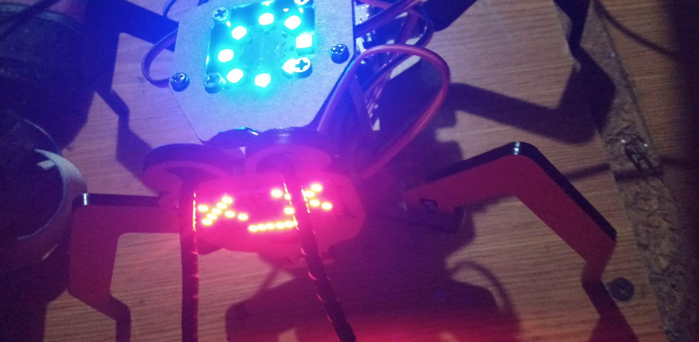
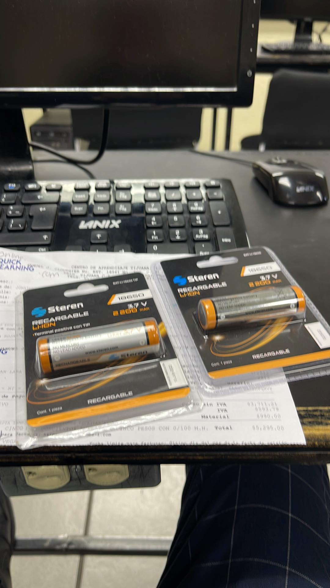

# Freenove Robot Ant Kit
##Lenguajes de interfaz Rene Solis ITT 2022

## Construcción y programación
> Se requiere de las herramientas necesarias y además del tiempo para leer el manual del fabricante,
> por lo que se tarda mas tiempo en el ensamblaje y las conexiones que en la programacion.
> 
> Primeramente se debe armar la estructura para después descargar el driver,agregar las librerías y subir el codigo sin tener el modulo bluetooth conectado a la placa.

- [Robot Ant Kit tutorial](https://freenove.com/fnk0042/)

## Evidencia

<a href="a3.mp4" title="Link Title">Video 1</a> 
<a href="a4.mp4" title="Link Title">Video 2</a> 
<a href="a5.mp4" title="Link Title">Video 3</a> 

 <a href="a7.mp4" title="Link Title">Video final</a>

## Codigo de buzzer para tocar musica .ino

           #define NOTE_B0  31
           #define NOTE_C1  33
           #define NOTE_CS1 35
           #define NOTE_D1  37
           #define NOTE_DS1 39
           #define NOTE_E1  41
           #define NOTE_F1  44
           #define NOTE_FS1 46
           #define NOTE_G1  49
           #define NOTE_GS1 52
           #define NOTE_A1  55
           #define NOTE_AS1 58
           #define NOTE_B1  62
           #define NOTE_C2  65
           #define NOTE_CS2 69
           #define NOTE_D2  73
           #define NOTE_DS2 78
           #define NOTE_E2  82
           #define NOTE_F2  87
           #define NOTE_FS2 93
           #define NOTE_G2  98
           #define NOTE_GS2 104
           #define NOTE_A2  110
           #define NOTE_AS2 117
           #define NOTE_B2  123
           #define NOTE_C3  131
           #define NOTE_CS3 139
           #define NOTE_D3  147
           #define NOTE_DS3 156
           #define NOTE_E3  165
           #define NOTE_F3  175
           #define NOTE_FS3 185
           #define NOTE_G3  196
           #define NOTE_GS3 208
           #define NOTE_A3  220
           #define NOTE_AS3 233
           #define NOTE_B3  247
           #define NOTE_C4  262
           #define NOTE_CS4 277
           #define NOTE_D4  294
           #define NOTE_DS4 311
           #define NOTE_E4  330
           #define NOTE_F4  349
           #define NOTE_FS4 370
           #define NOTE_G4  392
           #define NOTE_GS4 415
           #define NOTE_A4  440
           #define NOTE_AS4 466
           #define NOTE_B4  494
           #define NOTE_C5  523
           #define NOTE_CS5 554
           #define NOTE_D5  587
           #define NOTE_DS5 622
           #define NOTE_E5  659
           #define NOTE_F5  698
           #define NOTE_FS5 740
           #define NOTE_G5  784
           #define NOTE_GS5 831
           #define NOTE_A5  880
           #define NOTE_AS5 932
           #define NOTE_B5  988
           #define NOTE_C6  1047
           #define NOTE_CS6 1109
           #define NOTE_D6  1175
           #define NOTE_DS6 1245
           #define NOTE_E6  1319
           #define NOTE_F6  1397
           #define NOTE_FS6 1480
           #define NOTE_G6  1568
           #define NOTE_GS6 1661
           #define NOTE_A6  1760
           #define NOTE_AS6 1865
           #define NOTE_B6  1976
           #define NOTE_C7  2093
           #define NOTE_CS7 2217
           #define NOTE_D7  2349
           #define NOTE_DS7 2489
           #define NOTE_E7  2637
           #define NOTE_F7  2794
           #define NOTE_FS7 2960
           #define NOTE_G7  3136
           #define NOTE_GS7 3322
           #define NOTE_A7  3520
           #define NOTE_AS7 3729
           #define NOTE_B7  3951
           #define NOTE_C8  4186
           #define NOTE_CS8 4435
           #define NOTE_D8  4699
           #define NOTE_DS8 4978

          #define melodyPin 5

          int melody[] = {
            NOTE_E7, NOTE_E7, 0, NOTE_E7, 
            0, NOTE_C7, NOTE_E7, 0,
            NOTE_G7, 0, 0,  0,
            NOTE_G6, 0, 0, 0, 

            NOTE_C7, 0, 0, NOTE_G6, 
            0, 0, NOTE_E6, 0, 
            0, NOTE_A6, 0, NOTE_B6, 
            0, NOTE_AS6, NOTE_A6, 0, 

            NOTE_G6, NOTE_E7, NOTE_G7, 
            NOTE_A7, 0, NOTE_F7, NOTE_G7, 
            0, NOTE_E7, 0,NOTE_C7, 
            NOTE_D7, NOTE_B6, 0, 0,

            NOTE_C7, 0, 0, NOTE_G6, 
            0, 0, NOTE_E6, 0, 
            0, NOTE_A6, 0, NOTE_B6, 
            0, NOTE_AS6, NOTE_A6, 0, 

            NOTE_G6, NOTE_E7, NOTE_G7, 
            NOTE_A7, 0, NOTE_F7, NOTE_G7, 
            0, NOTE_E7, 0,NOTE_C7, 
            NOTE_D7, NOTE_B6, 0, 0
          };
          int tempo[] = {
            12, 12, 12, 12, 
            12, 12, 12, 12,
            12, 12, 12, 12,
            12, 12, 12, 12, 

            12, 12, 12, 12,
            12, 12, 12, 12, 
            12, 12, 12, 12, 
            12, 12, 12, 12, 

            9, 9, 9,
            12, 12, 12, 12,
            12, 12, 12, 12,
            12, 12, 12, 12,

            12, 12, 12, 12,
            12, 12, 12, 12,
            12, 12, 12, 12,
            12, 12, 12, 12,

            9, 9, 9,
            12, 12, 12, 12,
            12, 12, 12, 12,
            12, 12, 12, 12,
          };

          int underworld_melody[] = {
            NOTE_C4, NOTE_C5, NOTE_A3, NOTE_A4, 
            NOTE_AS3, NOTE_AS4, 0,
            0,
            NOTE_C4, NOTE_C5, NOTE_A3, NOTE_A4, 
            NOTE_AS3, NOTE_AS4, 0,
            0,
            NOTE_F3, NOTE_F4, NOTE_D3, NOTE_D4,
            NOTE_DS3, NOTE_DS4, 0,
            0,
            NOTE_F3, NOTE_F4, NOTE_D3, NOTE_D4,
            NOTE_DS3, NOTE_DS4, 0,
            0, NOTE_DS4, NOTE_CS4, NOTE_D4,
            NOTE_CS4, NOTE_DS4, 
            NOTE_DS4, NOTE_GS3,
            NOTE_G3, NOTE_CS4,
            NOTE_C4, NOTE_FS4,NOTE_F4, NOTE_E3, NOTE_AS4, NOTE_A4,
            NOTE_GS4, NOTE_DS4, NOTE_B3,
            NOTE_AS3, NOTE_A3, NOTE_GS3,
            0, 0, 0
          };
          int underworld_tempo[] = {
            12, 12, 12, 12, 
            12, 12, 6,
            3,
            12, 12, 12, 12, 
            12, 12, 6,
            3,
            12, 12, 12, 12, 
            12, 12, 6,
            3,
            12, 12, 12, 12, 
            12, 12, 6,
            6, 18, 18, 18,
            6, 6,
            6, 6,
            6, 6,
            18, 18, 18,18, 18, 18,
            10, 10, 10,
            10, 10, 10,
            3, 3, 3
          };
          //tronos
          int melodytronos[] = {
              NOTE_A4, NOTE_D4, NOTE_F4, NOTE_G4, NOTE_A4, NOTE_D4, NOTE_F4, NOTE_G4, NOTE_E4,
              NOTE_G4, NOTE_C4, NOTE_F4, NOTE_E4, NOTE_G4, NOTE_C4, NOTE_F4, NOTE_E4, NOTE_D4

          };

          // duracion notas: 1= negra 2 = blanca...

          int DuracionNotastronos[] = {
            2, 2, 4, 4, 2, 2, 4, 4, 1, 2, 2, 4, 4, 2, 2, 4, 4, 1,
          };
          //tronos
          void setup(void)
          {
             pinMode(5, OUTPUT);//buzzer
            // pinMode(13, OUTPUT);//led indicator when singing a note

          }
          void loop()
          {
          //sing the tunes
            sing(1);
            sing(1);
            sing(2);
          }
          int song = 0;

          void sing(int s){      
             // iterate over the notes of the melody:
             song = s;
             if(song==1){
                 // Notas de la melodia, :
            for (int Nota = 0; Nota < 18; Nota++) {

              // calculo de la duracin de la nota, dividimos un segundo por el tipo de nota

              int Duracion = 1000 / DuracionNotastronos[Nota];
          // pin usado numero 6
              tone(5, melodytronos[Nota], Duracion);

              // para oir bien la melodia entre notas aadimos un retardo de un 40%

              int pausa = Duracion * 1.40;
                 delay(pausa);

              // Paramos la melodia
              noTone(6);
            }

             }

             if(song==2){
               Serial.println(" 'Underworld Theme'");
               int size = sizeof(underworld_melody) / sizeof(int);
               for (int thisNote = 0; thisNote < size; thisNote++) {

                 // to calculate the note duration, take one second
                 // divided by the note type.
                 //e.g. quarter note = 1000 / 4, eighth note = 1000/8, etc.
                 int noteDuration = 1000/underworld_tempo[thisNote];

                 buzz(melodyPin, underworld_melody[thisNote],noteDuration);

                 // to distinguish the notes, set a minimum time between them.
                 // the note's duration + 30% seems to work well:
                 int pauseBetweenNotes = noteDuration * 1.30;
                 delay(pauseBetweenNotes);

                 // stop the tone playing:
                 buzz(melodyPin, 0,noteDuration);

              }

             }else{

               Serial.println(" 'Mario Theme'");
               int size = sizeof(melody) / sizeof(int);
               for (int thisNote = 0; thisNote < size; thisNote++) {

                 // to calculate the note duration, take one second
                 // divided by the note type.
                 //e.g. quarter note = 1000 / 4, eighth note = 1000/8, etc.
                 int noteDuration = 1000/tempo[thisNote];

                 buzz(melodyPin, melody[thisNote],noteDuration);

                 // to distinguish the notes, set a minimum time between them.
                 // the note's duration + 30% seems to work well:
                 int pauseBetweenNotes = noteDuration * 1.30;
                 delay(pauseBetweenNotes);

                 // stop the tone playing:
                 buzz(melodyPin, 0,noteDuration);

              }
            }
          }

          void buzz(int targetPin,long frequency, long length) {
            //digitalWrite(13,HIGH);
            long delayValue = 1000000/frequency/2; // calculate the delay value between transitions
            //// 1 second's worth of microseconds, divided by the frequency, then split in half since
            //// there are two phases to each cycle
            long numCycles = frequency * length/ 1000; // calculate the number of cycles for proper timing
            //// multiply frequency, which is really cycles per second, by the number of seconds to 
            //// get the total number of cycles to produce
            for (long i=0; i < numCycles; i++){ // for the calculated length of time…
              digitalWrite(targetPin,HIGH); // write the buzzer pin high to push out the diaphram
              delayMicroseconds(delayValue); // wait for the calculated delay value
              digitalWrite(targetPin,LOW); // write the buzzer pin low to pull back the diaphram
              delayMicroseconds(delayValue); // wait againf or the calculated delay value
            }
            //digitalWrite(13,LOW);

          }
          
          
## Participantes
- José Ojeda
- Pantoja Beny
- Gibrahn Duarte
- Jonathan Lara
- López Partida
- Luis Eduardo 
- Santiago Ricardo
- Cruz Aldo
- MARIA GUADALUPE 
- IRVIN MARIN 
- JESUS GABRIEL 
- SILVERIO ADRIAN 
